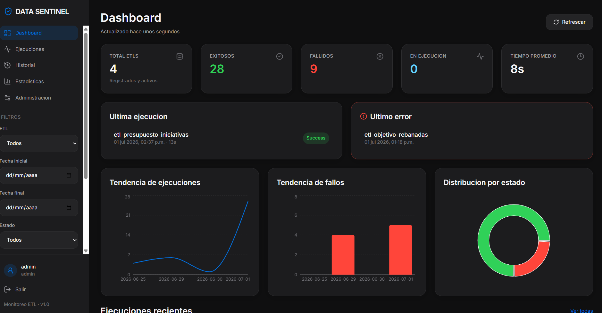
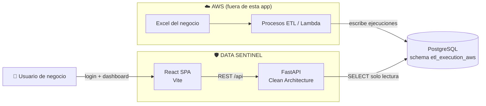

# 🛡️ DATA SENTINEL

> Panel web para verificar —sin tocar AWS— que los procesos ETL cargaron correctamente la información de los Excel en la base de datos.


---

## El problema

Los procesos ETL corren en **AWS** y cargan a PostgreSQL la información que sale de los Excel del negocio. Pero quien necesita confirmar que "los datos ya cargaron" —analistas, área de negocio, quien subió el Excel— **no tiene por qué entrar a la consola de AWS, leer logs de Lambda ni escribir SQL**.

**DATA SENTINEL** es la ventana simple a ese estado: una pantalla de login y un dashboard que responde de un vistazo _¿cargó?, ¿cuándo?, ¿cuántos registros?, ¿falló algo?_ — sin credenciales de nube ni conocimiento técnico.

> [!IMPORTANT]
> La app es **solo lectura**: nunca ejecuta ETLs ni modifica datos de ejecución. Únicamente `SELECT`.

---

## Cómo se ve

<!-- Reemplaza el archivo por una captura real del dashboard (recomendado: docs/images/dashboard.png, ~1600px de ancho) -->
<p align="center">
  
</p>

---

## Arquitectura



El backend **no se expone a Internet directamente**: escucha en `127.0.0.1` y nginx (o el contenedor web) es la única puerta de entrada con TLS.

---

## Qué ofrece

| Pantalla           | Responde                                                                                                                                                                              |
| ------------------ | ------------------------------------------------------------------------------------------------------------------------------------------------------------------------------------- |
| **Dashboard**      | Totales, exitosos/fallidos/en ejecución, tiempo promedio, última ejecución, último error, tendencias y ejecuciones recientes. Filtrable por ETL, fechas, estado, ambiente y servidor. |
| **Ejecuciones**    | Tabla paginada y ordenable con filtros básicos y avanzados (tipo, archivo origen, request ID).                                                                                        |
| **Detalle**        | Todo de una ejecución: tiempos, registros procesados, mensaje de error y stacktrace.                                                                                                  |
| **Historial**      | Todas las ejecuciones previas de un ETL específico.                                                                                                                                   |
| **Estadísticas**   | Promedios, máximos, mínimos, errores y tendencias semanal/mensual.                                                                                                                    |
| **Administración** | Registrar nuevas tablas ETL y activar/desactivar las existentes — sin redeploy.                                                                                                       |

---

## Stack

| Capa          | Tecnología                                                                      |
| ------------- | ------------------------------------------------------------------------------- |
| Frontend      | React 18 + TypeScript + Vite + TailwindCSS + TanStack Query + Recharts + Lucide |
| Backend       | FastAPI (Python 3.11+) + psycopg3, Clean Architecture                           |
| Base de datos | PostgreSQL (solo `SELECT` sobre datos ETL)                                      |
| Auth          | JWT + bcrypt, dominio restringido `@lazarza.com.mx`                             |
| Despliegue    | VPS (nginx + systemd) o Docker (2 contenedores + compose)                       |

---

## Estructura

```text
apps/
  api/          FastAPI (domain / application / infrastructure / interfaces / core)
  web/          React SPA (pages / features / components / services / hooks)
packages/
  types/        Tipos compartidos (espejo de los DTOs)
  utils/        Utilidades puras (formato, paginación)
scripts/
  db/                    SQL de metadatos y seed demo
  create_user.py         Alta de usuarios (bcrypt) — la app no cambia contraseñas
  change_password.py     Reset de contraseña (elegida o generada aleatoria)
docs/           Manuales de instalación, despliegue y operación (se publican)
```

---

## Documentación

| Documento                                                | Para qué                                                                |
| -------------------------------------------------------- | ----------------------------------------------------------------------- |
| [docs/MANUAL.md](docs/MANUAL.md)                         | **Primera vez** — instalación local paso a paso desde cero              |
| [apps/api/README.md](apps/api/README.md)                 | Backend: arquitectura, variables de entorno, tests, notas de producción |
| [apps/web/README.md](apps/web/README.md)                 | Frontend: desarrollo, build, gotcha de variables `VITE_*`, despliegue   |
| [docs/DEPLOY_DOCKER.md](docs/DEPLOY_DOCKER.md)           | Cómo está armado el empaquetado Docker, build y prueba local           |
| [docs/DOCKER_HUB_SETUP.md](docs/DOCKER_HUB_SETUP.md)     | Conectar Docker Hub a tu computadora (cuenta, token, login)             |
| [docs/DEPLOY_VPS.md](docs/DEPLOY_VPS.md)                 | **Runbook de producción real**: push a Docker Hub + pull en el VPS (nginx host, TLS, firewall) |
| [docs/CREAR_USUARIOS.md](docs/CREAR_USUARIOS.md)         | Cómo dar de alta un usuario                                             |
| [docs/CAMBIAR_CONTRASENA.md](docs/CAMBIAR_CONTRASENA.md) | Cómo resetear la contraseña de un usuario                               |

---

## Puesta en marcha rápida (local)

Guía completa con explicaciones: [docs/MANUAL.md](docs/MANUAL.md). Resumen:

```sql
-- 1. Base de datos, como administrador
\i scripts/db/01_metadata.sql   -- app_users + etl_registry
\i scripts/db/02_demo_seed.sql  -- (opcional) tablas y datos demo
```

```powershell
# 2. Tu usuario (ver docs/CREAR_USUARIOS.md)
python scripts/create_user.py usuario@lazarza.com.mx "Nombre Completo" admin

# 3. Backend — detalle en apps/api/README.md
cd apps/api
python -m venv .venv
.\.venv\Scripts\pip install -e ".[dev]"
copy .env.example .env   # editar credenciales
.\.venv\Scripts\uvicorn app.main:app --reload --port 8000

# 4. Frontend — detalle en apps/web/README.md
cd ..\..
npm install               # en la raíz (workspaces)
copy apps\web\.env.example apps\web\.env
npm run dev:web           # http://localhost:5173
```

Para producción: [docs/DEPLOY_DOCKER.md](docs/DEPLOY_DOCKER.md) explica el empaquetado, [docs/DEPLOY_VPS.md](docs/DEPLOY_VPS.md) es el runbook real (Docker Hub + VPS).

---

## Tests

```powershell
cd apps/api; .\.venv\Scripts\python -m pytest --cov   # backend
npm run test:web                                       # frontend
npm run build:web                                      # type-check + build
```

---

## Descubrimiento dinámico de ETLs

Las tablas de ejecución viven en el schema `etl_execution_aws` y se registran desde **Administración** (o `POST /api/etl-registry`). El backend:

1. Valida que el schema sea el configurado (`ETL_SCHEMA`).
2. Valida que la tabla exista físicamente (`information_schema`).
3. Guarda la configuración en `etl_registry`.
4. La incluye automáticamente en dashboard, consultas y estadísticas.

Sin cambios de código ni redeploy. Los nombres de tabla nunca se interpolan desde el cliente: se validan contra el registro y contra un patrón de identificador antes de citarse.

---

## API

| Método | Ruta                     | Descripción                                                              |
| ------ | ------------------------ | ------------------------------------------------------------------------ |
| POST   | `/api/auth/login`        | Login (correo institucional + password)                                  |
| GET    | `/api/auth/me`           | Usuario autenticado                                                      |
| GET    | `/api/dashboard`         | Indicadores generales (filtros: etl, fechas, estado, ambiente, servidor) |
| GET    | `/api/executions`        | Listado paginado/ordenable con filtros                                   |
| GET    | `/api/executions/{id}`   | Detalle (id compuesto `etl::clave::startTime`)                           |
| GET    | `/api/statistics`        | Estadísticas históricas + tendencias semanal/mensual                     |
| GET    | `/api/etl-registry`      | ETLs registrados                                                         |
| POST   | `/api/etl-registry`      | Registrar tabla ETL                                                      |
| PATCH  | `/api/etl-registry/{id}` | Activar/desactivar ETL                                                   |
| GET    | `/api/health`            | Estado de la aplicación y conexión a base                                |

Errores uniformes: `{"error": {"code", "message", "details"}}`. Nunca se exponen queries, stack traces internos ni `password_hash`.

---

## Variables de entorno

Backend ([apps/api/.env.example](apps/api/.env.example)): `DB_HOST`, `DB_PORT`, `DB_USER`, `DB_PASSWORD`, `DB_NAME` (la conexión se arma con estas, contraseña escapada automáticamente), `APP_METADATA_DATABASE_URL` (opcional), `DATABASE_URL` (opcional, override de URL completa), `API_ENV`, `API_PORT`, `LOG_LEVEL`, `AUTH_ALLOWED_EMAIL_DOMAIN`, `PASSWORD_HASH_ALGORITHM`, `AUTH_SECRET_KEY`, `AUTH_TOKEN_EXPIRE_MINUTES`, `ETL_SCHEMA`, `CORS_ALLOWED_ORIGINS`.

Frontend ([apps/web/.env.example](apps/web/.env.example)): `VITE_API_BASE_URL`.

---

## Decisiones y desviaciones documentadas

- **Vite en lugar de NextJS**: la arquitectura define `main.tsx` y `VITE_API_BASE_URL`.
- **Identificador compuesto** usa separador `::` (no `:`) porque los timestamps ISO contienen `:`.
- **PATCH /api/etl-registry/{id}** cubre "activar o desactivar un ETL" (Administración).
- Sin framer-motion/shadcn como dependencias: componentes propios con los tokens del design system; animaciones vía transiciones CSS.
- Ventana por defecto del dashboard: últimos 30 días cuando no se envía rango.
- **Conexión a Postgres armada desde `DB_HOST`/`DB_PORT`/`DB_USER`/`DB_PASSWORD`/`DB_NAME`** (con escape vía `quote_plus`). `DATABASE_URL` sigue como override opcional. Stack psycopg3 + pools (no SQLAlchemy) — ver [apps/api/app/core/settings.py](apps/api/app/core/settings.py).
- **Alias de estado ETL→BD**: algunos ETLs escriben `status='error'`/`'success'` en minúsculas. `ExecutionStatus.parse()` reconoce `ERROR` como alias de `FAILED` (ver [execution_status.py](apps/api/app/domain/value_objects/execution_status.py)).
- **Roles `admin`/`viewer` sin enforcement real todavía**: la columna existe pero ningún endpoint restringe acciones por rol. Pendiente si se requiere control de acceso real.
